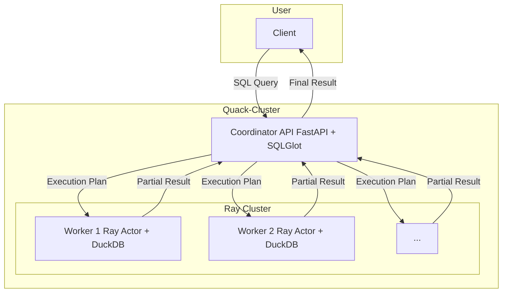

# 🦆 Quack-Cluster

[](https://www.google.com/search?q=https://github.com/your-username/quack-cluster)
[](https://opensource.org/licenses/MIT)

**Quack-Cluster** is a serverless, distributed SQL query engine designed for large-scale data analysis directly from object storage. This project combines the simplicity of Python with the orchestration power of [Ray](https://www.ray.io/) and the high-speed processing of [DuckDB](https://duckdb.org/).

-----

## ✨ Key Features

  * **Serverless & Distributed**: Run SQL queries on an elastically scalable cluster without complex server management.
  * **High-Speed Processing**: Leverages the speed of DuckDB's in-memory processing and the efficiency of the Apache Arrow data format.
  * **Python-Native**: Easily integrates into existing data science and engineering workflows.
  * **Cloud-Native**: Designed to read data directly from object storage like AWS S3, Google Cloud Storage, and more.
  * **Open Source**: Built with leading open-source technologies and open to contributions.

-----

## 🏛️ Architecture

The Quack-Cluster system consists of a central Coordinator and a set of Workers, all orchestrated by Ray.

1.  The **User** sends an SQL query to the Coordinator's API endpoint.
2.  The **Coordinator (FastAPI + SQLGlot)** parses the SQL, identifies the required data sources (e.g., file wildcards), and creates an execution plan.
3.  The **Ray Cluster** executes the plan by distributing tasks to multiple **Workers**.
4.  Each **Worker (Ray Actor)** uses its embedded **DuckDB** instance to process a subset of the data.
5.  The results are aggregated and returned to the user.

<!-- end list -->



-----

## 🚀 Getting Started

You only need Docker and `make` to get a local Quack-Cluster running.

### 1\. Prerequisites

  * [Docker](https://www.docker.com/products/docker-desktop/)
  * `make` (pre-installed on Linux/macOS; available on Windows via WSL).

### 2\. Installation & Setup

```bash
# 1. Clone this repository
git clone https://github.com/your-username/quack-cluster.git
cd quack-cluster

# 2. Generate sample data
# This creates sample parquet files in the ./data directory.
make data

# 3. Build and launch the cluster
# This command starts a Ray head node and 2 worker nodes.
make up scale=2
```

Once running, you can monitor the cluster status via the **Ray Dashboard** at `http://localhost:8265`.

-----

## 🚀 Testing with Postman

You can easily test all API features using the provided Postman collection.

1.  **Import the Collection and Environment**:
    * In Postman, click **Import** and select the following files:
    * **Collection**: `documentation/postman_collection/QuackCluster_API_Tests.json`
    * **Environment**: `documentation/postman_collection/QuackCluster_postman_environment.json`

2.  **Activate the Environment**:
    * In the top-right corner of Postman, select **"Quack Cluster Environment"** from the environment dropdown list.

3.  **Send a Request**:
    * The environment pre-configures the `baseUrl` variable to `http://127.0.0.1:8000`. You can now run any of the pre-built requests in the collection.

---

## 👨‍🏫 Tutorial: How to Use It

Use `curl` to send SQL queries to the API endpoint. The engine can automatically query across multiple files using wildcards in the `FROM` clause.

### Basic Queries

**1. Select All Data**

This query fetches all records from all `data_part_*.parquet` files and orders them.

```bash
curl -X 'POST' \
  'http://localhost:8000/query' \
  -H 'Content-Type: application/json' \
  -d '{"sql": "SELECT * FROM \"data_part_*.parquet\" ORDER BY id"}'
```

*Expected Output:*

```json
{
  "result": [
    {"id": 1, "product": "A", "sales": 100},
    {"id": 2, "product": "B", "sales": 150},
    {"id": 3, "product": "A", "sales": 120},
    {"id": 4, "product": "C", "sales": 300},
    {"id": 5, "product": "B", "sales": 250},
    {"id": 6, "product": "A", "sales": 200}
  ]
}
```

**2. Filter with `WHERE`**

This query selects records where sales are greater than 200.

```bash
curl -X 'POST' \
  'http://localhost:8000/query' \
  -H 'Content-Type: application/json' \
  -d '{"sql": "SELECT * FROM \"data_part_*.parquet\" WHERE sales > 200"}'
```

*Expected Output:*

```json
{
  "result": [
    {"id": 5, "product": "B", "sales": 250},
    {"id": 4, "product": "C", "sales": 300}
  ]
}
```

### Aggregation Queries

**1. Group By and Count**

This query counts the number of entries for each product.

```bash
curl -X 'POST' \
  'http://localhost:8000/query' \
  -H 'Content-Type: application/json' \
  -d '{"sql": "SELECT product, COUNT(*) as count FROM \"data_part_*.parquet\" GROUP BY product ORDER BY product"}'
```

*Expected Output:*

```json
{
  "result": [
    {"product": "A", "count": 3},
    {"product": "B", "count": 2},
    {"product": "C", "count": 1}
  ]
}
```

**2. Group By and Sum**

This query calculates the total sales for each product.

```bash
curl -X 'POST' \
  'http://localhost:8000/query' \
  -H 'Content-Type: application/json' \
  -d '{"sql": "SELECT product, SUM(sales) as total_sales FROM \"data_part_*.parquet\" GROUP BY product ORDER BY product"}'
```

*Expected Output:*

```json
{
  "result": [
    {"product": "A", "total_sales": 420.0},
    {"product": "B", "total_sales": 400.0},
    {"product": "C", "total_sales": 300.0}
  ]
}
```

**3. Group By and Average**

This query calculates the average sales for each product.

```bash
curl -X 'POST' \
  'http://localhost:8000/query' \
  -H 'Content-Type: application/json' \
  -d '{"sql": "SELECT product, AVG(sales) as avg_sales FROM \"data_part_*.parquet\" GROUP BY product ORDER BY product"}'
```

*Expected Output:*

```json
{
  "result": [
    {"product": "A", "avg_sales": 140.0},
    {"product": "B", "avg_sales": 200.0},
    {"product": "C", "avg_sales": 300.0}
  ]
}
```

## 💡 Query Scope & SQL Capabilities

The API leverages the **DuckDB SQL dialect**. You can query collections of data files (like Parquet or CSV) by referring to them as tables. The system supports glob patterns to query multiple files at once (e.g., `"data_part_*.parquet"`).

Below is a summary of supported SQL features.

### ✅ Basic Operations

  * **`SELECT`**: Select all (`*`) or specific columns.
  * **`FROM`**: Specify tables, including file glob patterns (e.g., `"data_part_*"`).
  * **`WHERE`**: Filter rows based on conditions.
  * **`GROUP BY`**: Group rows for aggregate functions.
  * **`ORDER BY`**: Sort the result set.
  * **`LIMIT` / `OFFSET`**: Paginate results.

### ✅ Aggregations & Grouping

  * **Aggregate Functions**: `COUNT()`, `SUM()`, `AVG()`, `MIN()`, `MAX()`.
  * **`HAVING`**: Filter groups after aggregation.

### ✅ Joins & Set Operations

  * **`INNER JOIN`**: Select matching records from two tables.
  * **`LEFT JOIN`**: Select all records from the left table and matched records from the right.
  * **`FULL OUTER JOIN`**: Select all records when there is a match in either the left or right table.
  * **`UNION ALL`**: Combine the result sets of two or more `SELECT` statements (including duplicates).

### ✅ Advanced SQL Features

  * **Subqueries**: Nest a `SELECT` statement inside another statement (e.g., in `FROM` or `WHERE IN (...)`).
  * **Common Table Expressions (CTEs)**: Use the `WITH` clause to define temporary, named result sets.
  * **Window Functions**: Perform calculations across a set of table rows (e.g., `SUM(...) OVER (PARTITION BY ...)`).
  * **Conditional Logic**: Use `CASE...WHEN...THEN...ELSE...END` statements.
  * **Advanced `SELECT` Syntax**:
      * `SELECT DISTINCT`: Return only unique values.
      * `SELECT DISTINCT ON (...)`: Return the first row for each unique group.
      * `SELECT * EXCLUDE (...)`: Select all columns except specified ones.
      * `SELECT * REPLACE (...)`: Replace a column's value with a new expression.
      * `SELECT COLUMNS('<regex>')`: Select columns that match a regular expression.
  * **Date/Time Functions**: Functions like `DATE_TRUNC` to manipulate date/time values.


## 🛠️ Development & Management

Use the following `make` commands to manage your development environment.

| Command | Description |
| :--- | :--- |
| `make up scale=N` | Starts all containers with `N` worker nodes (default: 1). |
| `make down` | Stops and removes running containers safely. |
| `make logs` | Tails the logs from all running services in real-time. |
| `make build` | Rebuilds the Docker images if you change a `Dockerfile`. |
| `make test` | Runs the `pytest` suite inside the `ray-head` container. |
| `make clean` | **DANGER:** Stops containers and deletes all associated volumes. |

-----

## 🗺️ Roadmap

  * [V] Support for `JOIN` operations across data sources.
  * [V] Support for Window Functions (`OVER`, `PARTITION BY`).
  * [ ] Integration with a metadata catalog like Apache Iceberg.
  * [ ] A dedicated Python client (SDK) for a more user-friendly experience.

-----

## 🤝 Contributing

Contributions are welcome\! Please feel free to open an issue to discuss a new feature or submit a pull request for improvements and bug fixes.

-----

Of course. Here is the revised section, which specifies that AI was used for development and documentation, while architecture and debugging were human-powered.

---

## 🤖 AI-Powered Development

This project leverages AI tools to accelerate development and improve documentation.

* **Development**: **GEMINI** was used for real-time code completion and generating routine code snippets.
* **Documentation**: **QWEN** assisted in drafting and refining parts of this README.

All core architectural decisions, debugging, and final testing are **human-powered** to ensure quality and correctness.

---

## 📄 License

This project is licensed under the [MIT License](https://www.google.com/search?q=LICENSE).