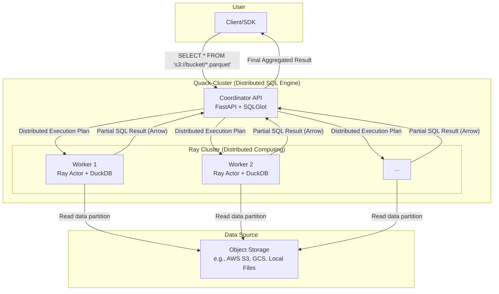

# 🦆 Quack-Cluster: A Serverless Distributed SQL Query Engine with DuckDB and Ray

[](https://opensource.org/licenses/MIT)
[](https://www.python.org/downloads/)
[](https://www.ray.io/)
[](https://duckdb.org/)

**Quack-Cluster** is a high-performance, serverless distributed SQL query engine designed for large-scale data analysis. It allows you to run complex SQL queries directly on data in object storage (like AWS S3 or Google Cloud Storage) by leveraging the combined power of **Python**, the **Ray** distributed computing framework, and the hyper-fast **DuckDB** analytical database.

It's an ideal, lightweight alternative to complex big data systems for all your analytical needs.

-----

## ✨ Core Features: A Modern Distributed Database

  * **Serverless & Distributed**: Effortlessly run SQL queries on a scalable **Ray cluster**. Forget about managing complex server infrastructure for your database needs.
  * **High-Speed SQL Processing**: Utilizes the incredible speed of **DuckDB's** in-memory, columnar-vectorized query engine and the efficiency of the Apache Arrow data format for blazing-fast analytics.
  * **Query Data Where It Lives**: Natively reads data files (Parquet, CSV, etc.) directly from object storage like **AWS S3**, **Google Cloud Storage**, and local filesystems. No ETL required.
  * **Python-Native Integration**: Built with Python, Quack-Cluster integrates seamlessly into your existing data science, data engineering, and machine learning workflows.
  * **Open Source Stack**: Built with a powerful, modern stack of open-source technologies, including **FastAPI**, **Ray**, and **DuckDB**.

-----

## 🏛️ Architecture: How Quack-Cluster Executes Distributed SQL

The Quack-Cluster system is designed for simplicity and scale. It distributes SQL queries across a Ray cluster, where each worker node uses an embedded DuckDB instance to process a portion of the data in parallel.

1.  A **User** sends a standard SQL query to the Coordinator's API endpoint.
2.  The **Coordinator (FastAPI + SQLGlot)** parses the SQL, identifies the target files (e.g., using wildcards like `s3://my-bucket/data/*.parquet`), and generates a distributed execution plan.
3.  The **Ray Cluster** orchestrates the execution by sending tasks to multiple **Worker** nodes.
4.  Each **Worker (a Ray Actor)** runs an embedded **DuckDB** instance to execute its assigned query fragment on a subset of the data.
5.  Partial results are efficiently aggregated by the Coordinator and returned to the user.

This architecture enables massive parallel processing (MPP) for your SQL queries, turning a collection of files into a powerful distributed database.



-----

## 🚀 Getting Started: Deploy Your Own Distributed SQL Cluster

You only need **Docker** and `make` to get a local Quack-Cluster running.

### 1\. Prerequisites

  * [Docker](https://www.docker.com/products/docker-desktop/)
  * `make` (pre-installed on Linux/macOS; available on Windows via WSL).

### 2\. Installation & Launch

```bash
# 1. Clone this repository
git clone https://github.com/your-username/quack-cluster.git
cd quack-cluster

# 2. Generate sample data (creates Parquet files in ./data)
make data

# 3. Build and launch your distributed cluster
# This command starts a Ray head node and 2 worker nodes.
make up scale=2
```

Your cluster is now running\! You can monitor the Ray cluster status at the **Ray Dashboard**: `http://localhost:8265`.


## 👨‍🏫 Tutorial: Running Distributed SQL Queries

Use any HTTP client like `curl` or Postman to send SQL queries to the API. The engine automatically handles file discovery with wildcards.

### Example: Aggregate Sales Data from Multiple Parquet Files

This query calculates the total sales for each product across all `data_part_*.parquet` files.

```bash
curl -X 'POST' \
  'http://localhost:8000/query' \
  -H 'Content-Type: application/json' \
  -d '{
    "sql": "SELECT product, SUM(sales) as total_sales FROM \"data_part_*.parquet\" GROUP BY product ORDER BY product"
  }'
```

*Expected Output:*

```json
{
  "result": [
    {"product": "A", "total_sales": 420.0},
    {"product": "B", "total_sales": 400.0},
    {"product": "C", "total_sales": 300.0}
  ]
}
```
-----

## 🚀 Testing with Postman

You can easily test all API features using the provided Postman collection.

1.  **Import the Collection and Environment**:
    * In Postman, click **Import** and select the following files:
    * **Collection**: `documentation/postman_collection/QuackCluster_API_Tests.json`
    * **Environment**: `documentation/postman_collection/QuackCluster_postman_environment.json`

2.  **Activate the Environment**:
    * In the top-right corner of Postman, select **"Quack Cluster Environment"** from the environment dropdown list.

3.  **Send a Request**:
    * The environment pre-configures the `baseUrl` variable to `http://127.0.0.1:8000`. You can now run any of the pre-built requests in the collection.

-----

## 💡 Powerful Distributed SQL Capabilities with DuckDB

Quack-Cluster supports a rich subset of the **DuckDB SQL dialect**, enabling complex analytical queries across multiple files and directories.

### ✅ Supported Operations

  * **Basic Queries**: `SELECT`, `FROM`, `WHERE`, `GROUP BY`, `ORDER BY`, `LIMIT`.
  * **Aggregate Functions**: `COUNT()`, `SUM()`, `AVG()`, `MIN()`, `MAX()`.
  * **Distributed Joins**: `INNER JOIN`, `LEFT JOIN`, `FULL OUTER JOIN` across different file sets.
  * **Advanced SQL**:
      * Subqueries (e.g., `WHERE IN (...)`)
      * Common Table Expressions (CTEs) using the `WITH` clause.
      * Window Functions (e.g., `SUM(...) OVER (PARTITION BY ...)`).
      * Advanced `SELECT` syntax like `SELECT * EXCLUDE (...)` and `SELECT COLUMNS('<regex>')`.
  * **File System Functions**: Query collections of Parquet or CSV files using glob patterns (e.g., `"s3://my-data/2025/**/*.parquet"`).

-----

## 🛠️ Development & Management Commands

Use these `make` commands to manage your development lifecycle.

| Command | Description |
| :--- | :--- |
| `make up scale=N` | Starts the cluster with `N` worker nodes. |
| `make down` | Stops and removes running containers safely. |
| `make logs` | Tails the logs from all services. |
| `make build` | Rebuilds the Docker images after a code change. |
| `make test` | Runs the `pytest` suite inside the `ray-head` container. |
| `make clean` | **DANGER:** Stops containers and deletes all data volumes. |

-----

## 🗺️ Project Roadmap

  * [✔] Support for distributed `JOIN` operations.
  * [✔] Support for Window Functions (`OVER`, `PARTITION BY`).
  * [ ] Integration with a metadata catalog like **Apache Iceberg** or **Delta Lake**.
  * [ ] A dedicated Python client (SDK) for a better developer experience.

-----

## 🤝 Contributing

Contributions are what make the open-source community such an amazing place to learn, inspire, and create. Any contributions you make are **greatly appreciated**. Please feel free to open an issue or submit a pull request.
## 🤖 AI-Powered Development

This project leverages AI tools to accelerate development and improve documentation.

All core architectural decisions, debugging, and final testing are **human-powered** to ensure quality and correctness.

---

## 📄 License

This project is licensed under the MIT License. See the [LICENSE](https://www.google.com/search?q=LICENSE) file for details.