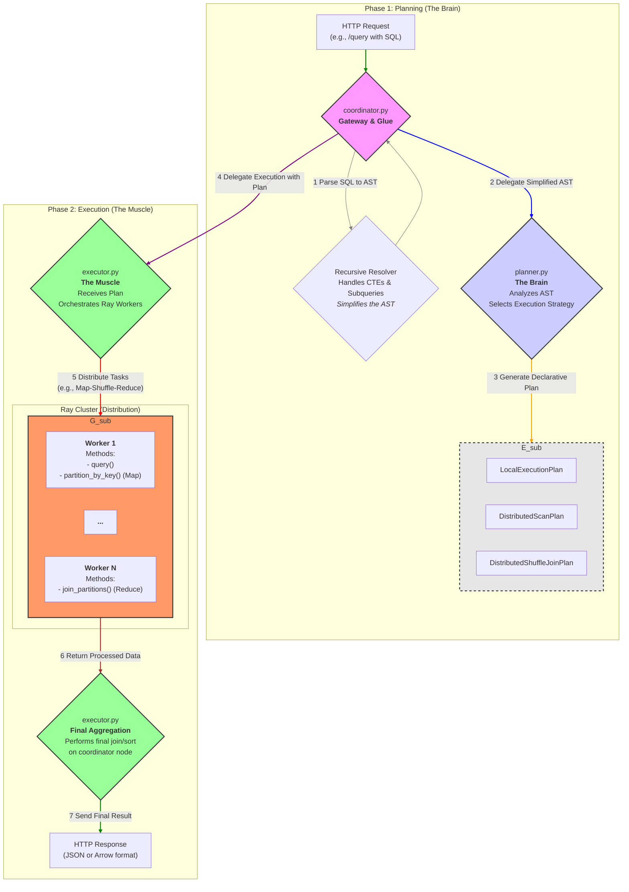

# Quack-Cluster System Architecture

This document describes the high-level architecture of Quack-Cluster, its design philosophy, and the responsibilities of each core component. The goal is to provide a solid understanding of how the system works as a whole.

-----

## 1\. Design Philosophy

The Quack-Cluster architecture is based on several key principles to ensure the system is modular, maintainable, and easy to extend:

  * **Separation of Concerns**: The logic for *planning* a query (what to do) is strictly separated from the logic for *executing* the query (how to do it).
  * **Single Responsibility Principle (SRP)**: Each module and class has one primary responsibility. The `Planner` only plans, the `Executor` only executes, and a `Worker` only performs a specific task on the data.
  * **Declarative Execution Plans**: The `Planner` produces a "plan," which is a simple data structure (a Pydantic model). This plan declaratively describes the steps to be executed without including the execution logic itself. This makes the workflow transparent and easy to debug.
  * **Extensibility**: By separating components, adding new functionality (like a new join strategy or optimization) can be done by modifying or adding components in isolation without disrupting other parts of the system.

-----

## 2\. High-Level Execution Flow

Every SQL query that enters the system goes through a series of well-defined steps.

-----

## 3\. Directory Structure & Core Components

Here is a detailed explanation of each core component within the `quack_cluster/` directory:

### `coordinator.py`

  * **Role**: The main entry point (gateway) and the "glue" that holds other components together.
  * **Responsibilities**:
    1.  **Endpoint Management**: Provides the FastAPI `/query` endpoint to receive SQL requests.
    2.  **Initial Parsing**: Uses `sqlglot` to parse the SQL string into an *Abstract Syntax Tree* (AST).
    3.  **Recursive Resolver**: Contains the `resolve_and_execute` recursive logic that handles complex SQL structures like **CTEs (WITH clauses)** and **Subqueries**. It "simplifies" the AST by executing these parts first.
    4.  **Delegation**: After the AST is simplified, it delegates the task to the `Planner` to create a plan and to the `Executor` to run that plan.

### `planner.py`

  * **Role**: The "brain" of the query engine.
  * **Responsibilities**:
    1.  **AST Analysis**: Receives the simplified AST from the `coordinator`.
    2.  **Strategy Selection**: Contains all the logic for deciding the *best way* to execute the query. It determines whether the query should be:
          * Run locally on the coordinator (`LocalExecutionPlan`).
          * Run as a distributed file scan (`DistributedScanPlan`).
          * Run as a distributed shuffle join (`DistributedShuffleJoinPlan`).
    3.  **Plan Creation**: Generates an `ExecutionPlan` object that contains all the information the `Executor` needs to run the query, such as table names, join keys, and SQL templates for the workers.

### `execution_plan.py`

  * **Role**: The "contract" or data blueprint.
  * **Responsibilities**:
    1.  **Structure Definition**: Defines a series of Pydantic classes (`LocalExecutionPlan`, `DistributedScanPlan`, etc.) that serve as the standard data structure for an execution plan.
    2.  **Data Validation**: Ensures that the `Planner` provides all the information needed by the `Executor` through Pydantic validation. This prevents errors due to inconsistent data.

### `executor.py`

  * **Role**: The "muscle" of the query engine.
  * **Responsibilities**:
    1.  **Plan Execution**: Receives an `ExecutionPlan` object from the `coordinator`.
    2.  **Ray Orchestration**: Contains all the logic for interacting with Ray. It calls `DuckDBWorker.remote()`, distributes tasks, and gathers the results (`asyncio.gather`).
    3.  **Flow Implementation**: Implements the specific workflow for each type of plan (e.g., the *map-shuffle-reduce* flow for a `DistributedShuffleJoinPlan`).
    4.  **Final Aggregation**: After the data is processed by the workers, the `Executor` is responsible for performing the final aggregation or sorting steps on the coordinator before returning the final result.

### `worker.py`

  * **Role**: An individual, distributed unit of work.
  * **Responsibilities**:
    1.  **Ray Actor**: Defined as a `@ray.remote class DuckDBWorker`. Each worker runs in its own process.
    2.  **Specific Task Execution**: Provides methods to perform heavy lifting on the data, such as:
          * `query()`: Executes a query on a set of Parquet files.
          * `partition_by_key()`: Reads data and partitions it by a key for a shuffle join (the Map phase).
          * `join_partitions()`: Receives data partitions from other workers and performs the join locally (the Reduce phase).
    3.  **Isolation**: Each worker has its own DuckDB connection and is unaware of other workers. It only receives a task, executes it, and returns the result.