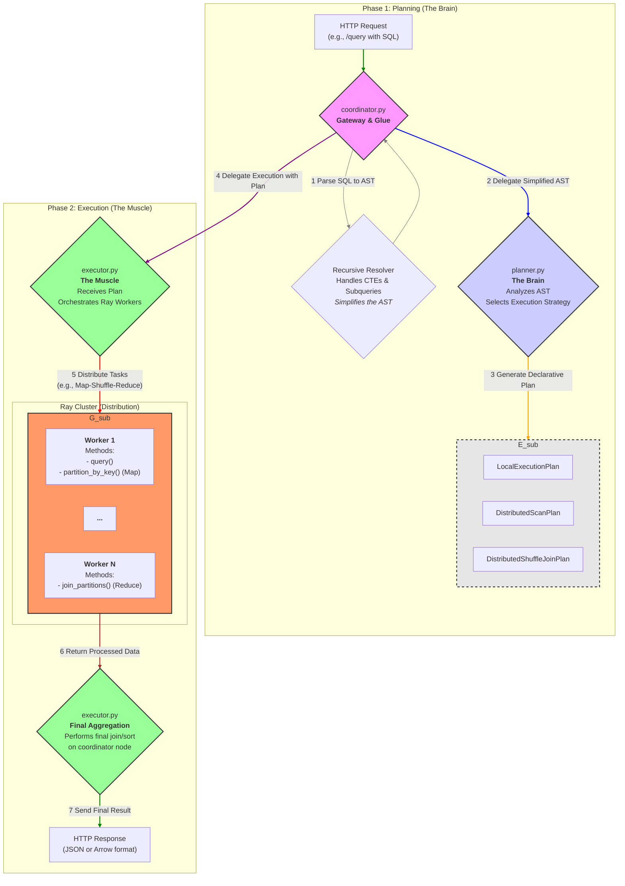

# Arsitektur Sistem Quack-Cluster

Dokumen ini menjelaskan arsitektur tingkat tinggi dari Quack-Cluster, filosofi desain, dan tanggung jawab dari setiap komponen utama. Tujuannya adalah untuk memberikan pemahaman yang kuat tentang bagaimana sistem bekerja secara keseluruhan.

---

## 1. Filosofi Desain

Arsitektur Quack-Cluster didasarkan pada beberapa prinsip utama untuk memastikan sistem yang modular, dapat di-maintain, dan mudah dikembangkan:

* **Pemisahan Tanggung Jawab (Separation of Concerns)**: Logika untuk *merencanakan* sebuah query (apa yang harus dilakukan) dipisahkan secara tegas dari logika untuk *mengeksekusi* query (bagaimana melakukannya).
* **Single Responsibility Principle (SRP)**: Setiap modul dan kelas memiliki satu tanggung jawab utama. `Planner` hanya merencanakan, `Executor` hanya mengeksekusi, dan `Worker` hanya mengerjakan tugas spesifik pada data.
* **Rencana Eksekusi Deklaratif (Declarative Execution Plans)**: `Planner` menghasilkan sebuah "rencana" yang merupakan struktur data sederhana (Pydantic model). Rencana ini secara deklaratif menggambarkan langkah-langkah yang harus dieksekusi, tanpa menyertakan logika eksekusinya. Ini membuat alur kerja menjadi transparan dan mudah di-debug.
* **Ekstensibilitas**: Dengan memisahkan komponen, menambahkan fungsionalitas baru (seperti strategi join baru atau optimisasi) dapat dilakukan dengan memodifikasi atau menambah komponen secara terisolasi tanpa mengganggu bagian lain dari sistem.

---

## 2. Alur Eksekusi Tingkat Tinggi (High-Level Flow)

Setiap query SQL yang masuk ke sistem akan melalui serangkaian langkah yang terdefinisi dengan baik.





## 3. Struktur Direktori & Komponen Inti

Berikut adalah penjelasan rinci dari setiap komponen utama dalam direktori `quack_cluster/`:

### `coordinator.py`
* **Peran**: Titik masuk utama (gateway) dan "lem" yang menyatukan komponen lain.
* **Tanggung Jawab**:
    1.  **Manajemen Endpoint**: Menyediakan endpoint FastAPI `/query` untuk menerima request SQL.
    2.  **Parsing Awal**: Menggunakan `sqlglot` untuk mem-parsing string SQL menjadi *Abstract Syntax Tree* (AST).
    3.  **Resolver Rekursif**: Berisi logika rekursif `resolve_and_execute` yang menangani struktur SQL kompleks seperti **CTE (WITH clauses)** dan **Subqueries**. Ia akan "menyederhanakan" AST dengan mengeksekusi bagian-bagian ini terlebih dahulu.
    4.  **Delegasi**: Setelah AST disederhanakan, ia mendelegasikan tugas ke `Planner` untuk membuat rencana dan ke `Executor` untuk menjalankan rencana tersebut.

### `planner.py`
* **Peran**: "Otak" dari query engine.
* **Tanggung Jawab**:
    1.  **Analisis AST**: Menerima AST yang sudah disederhanakan dari `coordinator`.
    2.  **Pemilihan Strategi**: Berisi semua logika untuk memutuskan *cara terbaik* menjalankan query. Ia akan menentukan apakah query harus:
        * Dijalankan secara lokal di koordinator (`LocalExecutionPlan`).
        * Dijalankan sebagai pemindaian file terdistribusi (`DistributedScanPlan`).
        * Dijalankan sebagai *shuffle join* terdistribusi (`DistributedShuffleJoinPlan`).
    3.  **Pembuatan Rencana**: Menghasilkan sebuah objek `ExecutionPlan` yang berisi semua informasi yang dibutuhkan `Executor` untuk menjalankan query, seperti nama tabel, kunci join, dan template SQL untuk worker.

### `execution_plan.py`
* **Peran**: "Kontrak" atau cetak biru (blueprint) data.
* **Tanggung Jawab**:
    1.  **Definisi Struktur**: Mendefinisikan serangkaian kelas Pydantic (`LocalExecutionPlan`, `DistributedScanPlan`, dll.) yang menjadi struktur data standar untuk sebuah rencana eksekusi.
    2.  **Validasi Data**: Memastikan bahwa `Planner` menyediakan semua informasi yang dibutuhkan `Executor` melalui validasi Pydantic. Ini mencegah error karena data yang tidak konsisten.

### `executor.py`
* **Peran**: "Otot" dari query engine.
* **Tanggung Jawab**:
    1.  **Eksekusi Rencana**: Menerima objek `ExecutionPlan` dari `coordinator`.
    2.  **Orkestrasi Ray**: Berisi semua logika untuk berinteraksi dengan Ray. Ia yang memanggil `DuckDBWorker.remote()`, mendistribusikan tugas, dan mengumpulkan hasil (`asyncio.gather`).
    3.  **Implementasi Alur**: Mengimplementasikan alur kerja spesifik untuk setiap jenis rencana (misalnya, alur *map-shuffle-reduce* untuk `DistributedShuffleJoinPlan`).
    4.  **Agregasi Final**: Setelah data diproses oleh worker, `Executor` bertanggung jawab untuk melakukan langkah agregasi atau pengurutan terakhir di koordinator sebelum mengembalikan hasil akhir.

### `worker.py`
* **Peran**: Unit kerja individual yang terdistribusi.
* **Tanggung Jawab**:
    1.  **Ray Actor**: Didefinisikan sebagai `@ray.remote class DuckDBWorker`. Setiap worker berjalan dalam prosesnya sendiri.
    2.  **Eksekusi Tugas Spesifik**: Menyediakan metode untuk melakukan tugas-tugas berat pada data, seperti:
        * `query()`: Menjalankan query pada satu set file Parquet.
        * `partition_by_key()`: Membaca data dan mempartisinya berdasarkan kunci untuk *shuffle join* (fase Map).
        * `join_partitions()`: Menerima partisi data dari worker lain dan melakukan join secara lokal (fase Reduce).
    3.  **Isolasi**: Setiap worker memiliki koneksi DuckDB sendiri dan tidak sadar akan worker lainnya. Ia hanya menerima tugas, mengerjakannya, dan mengembalikan hasil.
```

-----